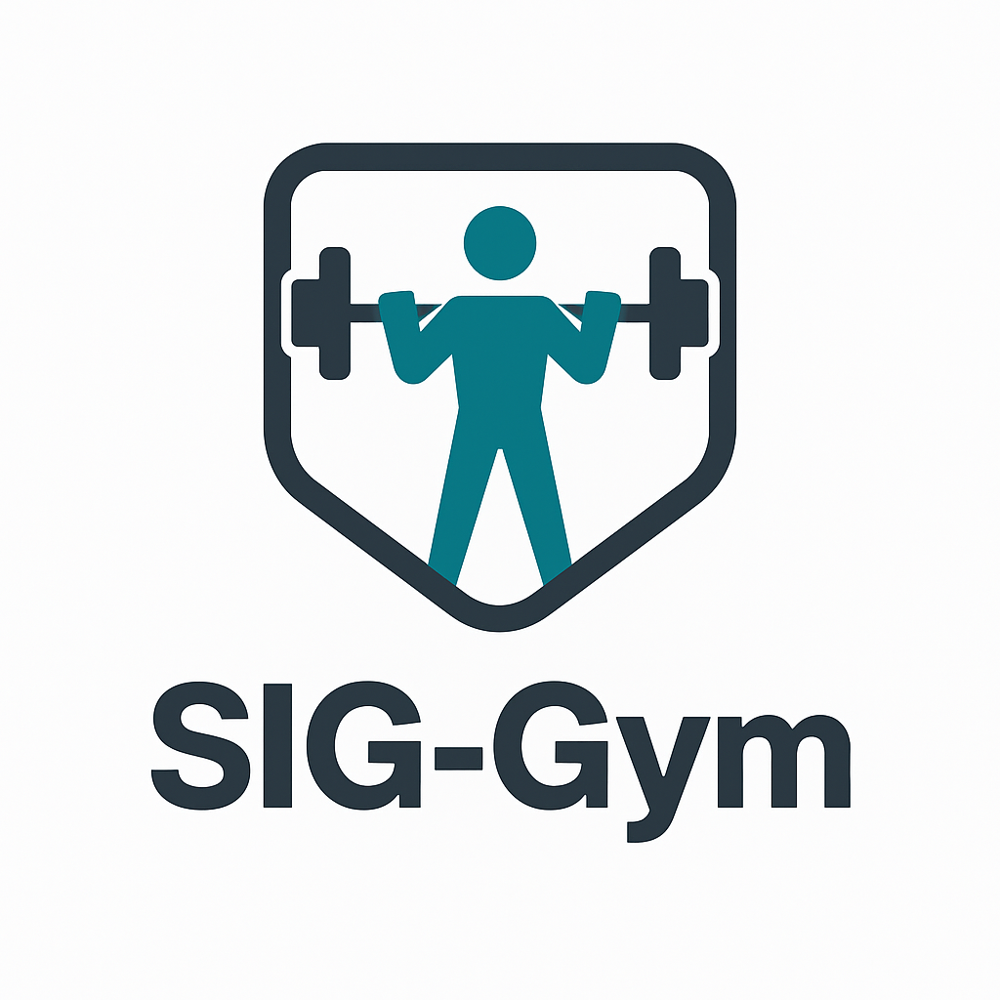

# SIG-Gym: Um Sistema de Gestão de Academias

<p align="center">
  
</p>

Sistema acadêmico de **gestão de academia** desenvolvido em **C99** sem a utilização de bibliotecas externas.  
**Disciplina**: DCT1106 — Programação.  

---

## Índice
- [1. Como compilar e executar](#1-como-compilar-e-executar)

---

## 1. Como compilar e executar
> Requer GCC com suporte a C99.

### Comando direto
Na raiz do projeto, execute:

```bash
make run          # Linux/Mac
mingw32-make run  # Windows (PowerShell ou CMD)
